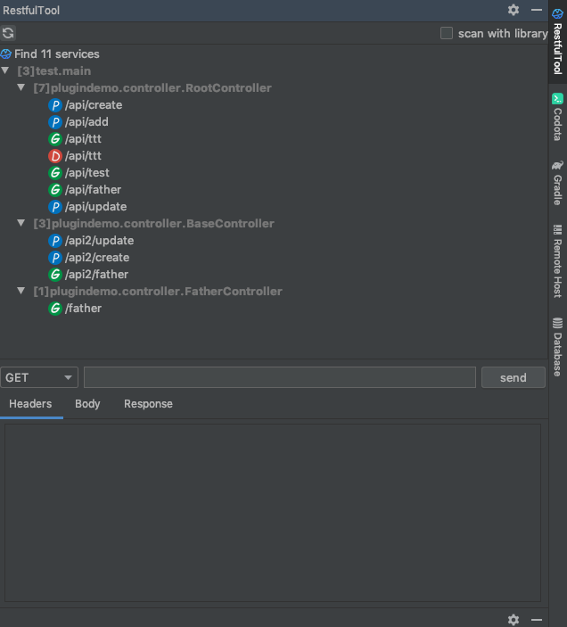
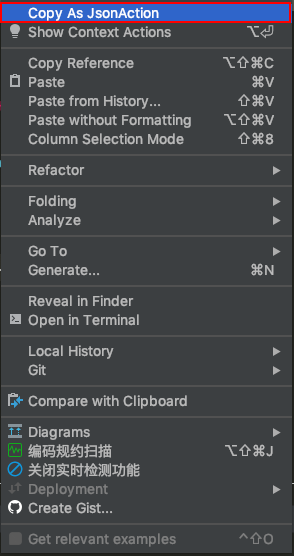

# IDEA 插件开发学习
## 源码来源
* [RestfulTool](https://github.com/ZhangYuanSheng1217/RestfulTool)
* [liuzhihangs/copy-as-json](https://github.com/liuzhihangs/copy-as-json)

对`RestfulTool`模块代码进行了魔改，新增和修改了部分功能，更改功能如下：
* 原始的插件仅仅区分了不同模块的请求，并没有详细到不同`controller`，为此我将`url`区分到了不同`controller`
* 原始插件存在的问题修复：

    1.如果在`controller`类或方法上增加`@RequestMapping`注解，同时赋予了`method`属性，那么计算出来的`url`是不正确的
    
    2.原始插件没有考虑`controller`类继承情况，如果出现`controller`类继承自一个`controller`类，那么`url`也存在问题
* 效果图如下：

同时新增了部分功能，将`copy-as-json`功能整合到了`RestfulTool`

* 效果图

